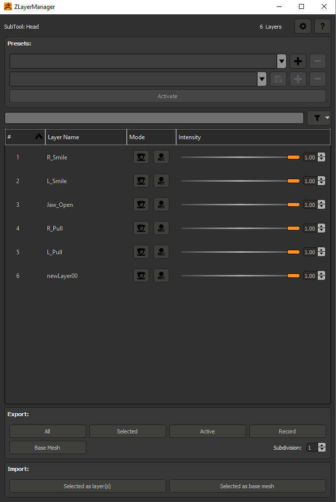

User Guide
==========

In this page, you'll be able to access information on the different UI elements of the tool going from top to bottom.

At the top right corner there are two buttons.  The **question mark** one open this page and the one with the **gear** open the `settings
<settings.html>`_.

.. toctree::

    settings
    preset
    layerdisplay
    export
    import
