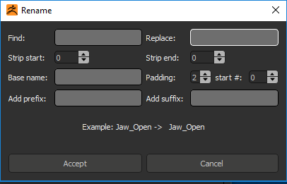

Layer display
=============

This is where the layers are displayed and this is where most of the layer edition operation take place.

* **Activate/deactive** a layer by clicking on the **eye** button.
* **Record** as layer by clicking on the **REC** button
* **Change intensity** by dragging the slider

The user can filter layers by name or by mode (Deactivated, Activated, Recording) with the **funnel** button.

Edition context menu
--------------------

.. image:: ../_static/contextmenu.png
   :class: align-right
   :scale: 80 %

Right clicking in the view open menu with additional operation:

* **Rename layer** rename the selected layer if there is only one selected otherwise rename the layer under the mouse cursor.
* **Rename selected layers** Open `Rename`_ dialog.
* **Fix up layers name** This option will remove any layer name duplicates and remove any fancy characters (&*-%^) that can be used in Zbrush when naming the layer but that is not accepted in other software or for a file name. 

*The rest of the operations are pretty self explanatory* 

Rename
------

User has the posibility to rename multiple layer at the same time.  This window is avaible in the `Edition context menu`_ when the user have
two or more layers selected.

.. raw:: html

    

    <h3>Warning</h3>Layer can only have a maximum of <b>15 characters</b> so the resulting name might be stripped down.
    

Hot Keys
--------

* **Ctrl+A** Select all layers currently displayed.
* **Ctrl+I** Inverse selection
* **Ctrl+X** Clear selection